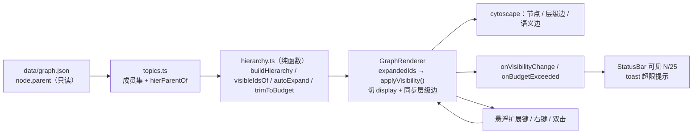

## Context

`Graphify/` 画布目前用 cytoscape 的 **compound** 表达层级：`cytoscapeSetup.ts:255` 把 `node.parent` 直接写进元素 data，就这一个赋值让「有子节点的节点」变成容器，并连带出整条链条：

- `styles.ts:81-125` 的 `compoundRules`（`node:parent` 展开态 6% 底色 + `padding: 36px`；`node.collapsed` 152×46 折叠方块）；
- `cytoscapeSetup.ts:180-198` `orderByParent`（父必须先于子加入，否则 compound 关系丢失）；
- `cytoscapeSetup.ts:347-362` `realParent` / `effectiveParent`（话题过滤下把父链越界的成员 `move({ parent })` 提升）；
- `cytoscapeSetup.ts:364-374` `isFoldable` / `visibleRoots`，`448-465` `foldToDepth`，`473-494` `toggleCollapse`，`497-517` `collapseAll`/`expandAll`；
- `lib/topics.ts:7` `DEFAULT_FOLD_DEPTH`、`64-78` `parentOverride`。

实测当前数据：59 节点 / 0 关系，其中**有子节点的节点 20 个**（即 20 个框），叶子 39 个，顶层 3 个，层级最深 3 层。顶层三个框的直系子分别为 2 / 4 / 4。话题规模：nion 40、engine 14、pending 8、全部 59。

compound 的代价不只是观感：父子关系与元素几何被绑死，于是折叠必须改写结构、隐藏的容器仍带模型包围盒（fcose 在 `nodeDimensionsIncludeLabels` 下量不到标签宽度直接抛 `Cannot read properties of undefined (reading 'labelWidth')`）、取景与命中必须额外判断祖先是否隐藏。上一次 change（`graphify-boot-fallback-renderer-hardening`）已按「只把可见元素交给布局」绕过该崩溃，但根因是 compound 本身。

## Goals / Non-Goals

**Goals**

- 画布上不再出现任何分组容器与折叠方块。
- 层级关系用父子连线表达，未展开分支在原节点上标记。
- 每张画布可见节点数硬上限 25，超限动作被拒绝并给出可操作的提示。
- 逐层展开/收起，打开与切换话题时确定性裁剪到上限内。
- 默认使用 cytoscape 内置层级布局。
- 全流程不新增依赖、不改数据与接口、不破坏上一次 change 的运行时兜底。

**Non-Goals**

- 不改 `Graphify/data/*.json`、`Graphify/scripts/build-*.mjs`、`Graphify/server/**`。
- 不改图谱数据格式（`node.parent` 保留原样，只是不再喂给 cytoscape 作为 compound）。
- 不做话题的增删改（当前话题规模由数据决定，超限时只能提示用户切到更细分的话题）。
- 不引入 dagre / elk / 自研布局。

## Decisions

### D1：层级不再进入 cytoscape 元素模型，改由纯函数模型派生

删除 `cytoscapeSetup.ts:255` 处的 `parent` 字段赋值与 `orderByParent`，新增 `src/graph/hierarchy.ts`（不 import cytoscape，可在 node 下直接用真实数据验证）：

```ts
export const MAX_VISIBLE_NODES = 25

export interface Hierarchy {
  parentOf: Map<string, string | null>
  childrenOf: Map<string, string[]>
  roots: string[]
}

export function buildHierarchy(
  nodes: readonly { id: string; parent: string | null }[],
  hierParentOf: ReadonlyMap<string, string | null> | null,
): Hierarchy
export function visibleIdsOf(h: Hierarchy, expandedIds: ReadonlySet<string>): Set<string>
export function autoExpand(h: Hierarchy, budget?: number): Set<string>
export function trimToBudget(h: Hierarchy, expandedIds: ReadonlySet<string>, budget?: number): Set<string>
```

**理由**：可见集、预算检查、默认裁剪、层级边全部从这一处派生，消灭第二套真相。纯函数可以在没有浏览器的情况下用真实 `data/graph.json` 断言。

**备选**：保留 compound 只隐藏子节点——不可行，`display:none` 不改变 compound 包含语义，正是过去必须 `move({ parent })` 改写结构的原因；且隐藏容器仍带模型包围盒继续触发 fcose 崩溃。`dagre/elk` 需新增依赖，被用户明确排除。

### D2：可见性 = 从顶层沿已展开节点做 BFS

```ts
visible(节点) ⟺ 其层级父级不存在（顶层）或在 expandedIds 中
```

不用 `display:none` 表达可见性（那是渲染结果），而是每次由 BFS 算出可见 id 集，再**幂等地**落到元素上：先对所有节点与边 `removeStyle('display')`，再对不可见者设 `none`。沿用 `applyCollapseState`（`cytoscapeSetup.ts:390-442`）已验证的「先还原后施加」顺序——上一 change 修的「关系不还原」缺陷在结构上被消除，因为不再有只针对某一类元素的增量还原。

### D3：预算的单一拦截点是 `expandNode(id)`

先在候选展开集（`expandedIds ∪ {id}`）上试算 `visibleIdsOf`，超过 25 则**不做任何改动**，回调 `onBudgetExceeded`，返回 `false`。UI 层据此弹一条固定 id 的 toast（与既有 `layout-error` 同一套路，避免刷屏）。

`expandToBudget()`（工具条「全部展开」）复用 `autoExpand`，在上限内继续确定性展开，返回是否展开完；未展开完时说明「已达上限」。

### D4：默认裁剪的确定性顺序

逐轮在「已可见、有直系子、且放得进预算」的候选中取：

1. 所在层更浅优先；
2. 直系子节点更多优先；
3. id 字典序更小优先。

取第一个展开，重复至放不下为止。结果只依赖数据，同一话题每次一致（满足 `graphify-canvas-budget` 的「结果可复现」）。

`trimToBudget` 用相反顺序（更深 → 子更少 → id 更大）撤销展开，作为数据变化后的自愈路径。

### D5：层级边独立于语义边

- id 前缀 `hier:`，并在 data 上打 `hier: true`。
- **必须**在 `sync` 的边清理循环（`cytoscapeSetup.ts:285-287` 当前会无差别删除不在 `graph.json` 里的边）中跳过层级边，否则每次同步都会被删除。
- 样式：细实线、无箭头、低饱和、无标签；`z-index` 低于语义边。
- 交互：`tap` / `cxttap` 忽略层级边；层级边不参与关系编辑与删除入口。

**备选**：复用现有 `graph.json` 的 links 表达层级——不可行，当前 `links` 为空且层级来自 `data/nion.outline.json`，不能依赖数据侧补边。

### D6：元素不增删（层级边除外）

仍只切 `display`，不删除节点元素——`position` 必须跨话题保留（`graphify-topic-views` 的「位置在往返切换后不变」）。层级边是唯一的动态边，按可见集增删。

### D7：默认布局改为内置层级布局

`App.tsx:53` 的 `useState<LayoutKind>('fcose')` 改为 `'breadthfirst'`；`layout.ts:67-78` 已有「层级」标签与参数，按树形微调（保留 `directed: true`、`grid: true`，配合 `avoidOverlap`）。`LayoutKind` 与工具条选项不变。

fcose 参数里关于复合容器的注释（`layout.ts:28`、`37-38`）需改写；`nodeDimensionsIncludeLabels` 保留（对普通节点仍有意义）。`layout.ts:96-98` 的 `node.visible()` 过滤与 `onLayoutError` 上报**必须保留**：容器消失后 `labelWidth` 根因虽已消除，但该过滤与失败可见性仍是既定契约。

### D8：展开/收起后的重排分两种

- 层级布局：整棵可见树重排（`runLayout`），因为层级布局下节点位置由层级决定，局部重排会破坏层序。
- 其它布局：沿用 `runLocalLayout`（`fit: false`，只重排 `父 ∪ 新可见子` 子集），不跳视口。

### D9：话题过滤只算层级父级

`lib/topics.ts` 去掉 `DEFAULT_FOLD_DEPTH`；`TopicVisibility.parentOverride` 更名 `hierParentOf`，语义改为「当前可见集内的层级父级」，计算逻辑不变（`topics.ts:64-78` 的最近同话题祖先）。`topicVisibilityKey` 的结构部分继续包含该映射（它已包含层级结构，指纹语义不变，因此普通编辑不会触发重新裁剪/取景）。

`GraphRenderer` 侧不再 `move({ parent })`，`effectiveParent` / `realParent` / `sourceParents` 一并删除。

## Architecture



## 对外契约变化（`GraphRenderer`）

```ts
export interface RendererHandlers {
  onVisibilityChange?: (info: { visible: number; budget: number; hiddenBranches: number }) => void
  onBudgetExceeded?: (info: { limit: number; wouldBe: number }) => void
}

class GraphRenderer {
  expandNode(id: string): boolean          // false = 被预算拒绝且画布未改动
  collapseNode(id: string): void
  expandToBudget(): boolean                // false = 未全部展开（已达上限）
  collapseAll(): void
  expansionInfo(id: string): { hiddenChildren: number; expanded: boolean }
  resetExpansion(budget?: number): void    // 首帧 / 话题切换
  setTopicFilter(filter: TopicVisibility | null): void
}
```

删除：`CollapseInfo`、`onCollapseChange`、`toggleCollapse`、`expandAll`、`foldToDepth`、`childInfo`、`isCollapsed`、`getCollapsedIds`。

## Risks / Trade-offs

| 风险 | 处置 |
| --- | --- |
| 层级边被 `sync` 的边清理循环误删 | 清理循环按 `hier:true` 跳过；并在纯函数校验脚本里断言「同步后层级边数量 == 应绘制数量」 |
| 25 上限使 nion（40 节点）/ 全部（59 节点）打开即被裁剪，用户误以为「节点丢了」 | 状态条常显「可见 N / 25」并变色；未展开分支有虚线标记与 `· N` 计数；超限提示与「全部展开」说明都指向「切到细分话题」。顶层节点永不被裁剪 |
| 默认展开顺序改变导致每次打开布局与以往不同 | 顺序确定（层浅 → 子多 → id 字典序），可复现；属于预期的行为变化 |
| 层级布局（breadthfirst）在 25 节点下观感 | `avoidOverlap` + `spacingFactor` 微调；工具条仍可切 fcose / 同心圆 / 网格 / 环形 |
| 破坏上一次 change 的兜底 | 保留 `index.html` 启动看门狗、`AppErrorBoundary`、`main.tsx` 全局错误收敛、`onLayoutError` 提示、`element.visible()` 取景与命中；改动后重跑 `tsc -b` / `eslint` / `vite build` |
| 悬浮扩展键在缩得很小时误点 | 缩放低于约 0.6 时隐藏；跟随沿用现有 rAF 机制 |

## Migration

- 无需数据迁移：`node.parent` 原样保留，只是渲染语义从「compound 父子」变为「层级父级」。
- 用户可见的行为变化：打开后不再看到框；画面节点数被限制在 25；更深内容需逐层展开。
- 文档：`docs/DIRECTORY.md` §7 补一条变更记录；§8 中「compound 折叠 / 默认折叠深度 1 / 3 个方块」等表述改写为「层级连线 + 25 节点预算 + 逐层展开」。
- 归档时另需修订主 spec `graphify-canvas-layout` 的 Purpose（当前仍为归档器生成的 TBD 占位）与 `graphify-canvas-appearance` 的 Purpose（原文只讲分组容器）。

## Open Questions

无。上限数值（25）、超限行为（硬拒绝）、默认布局（层级）均已由使用者确认。
